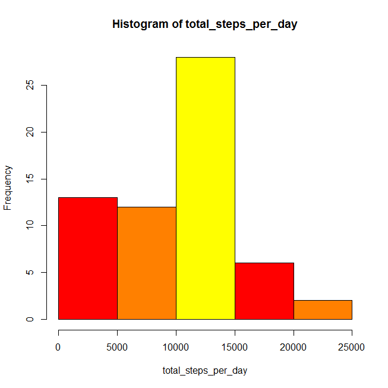
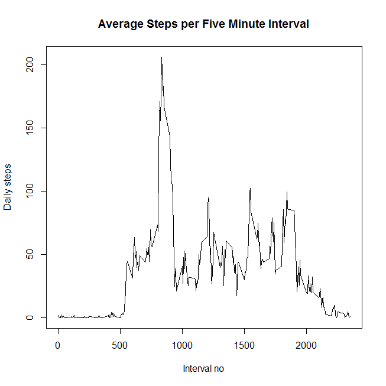
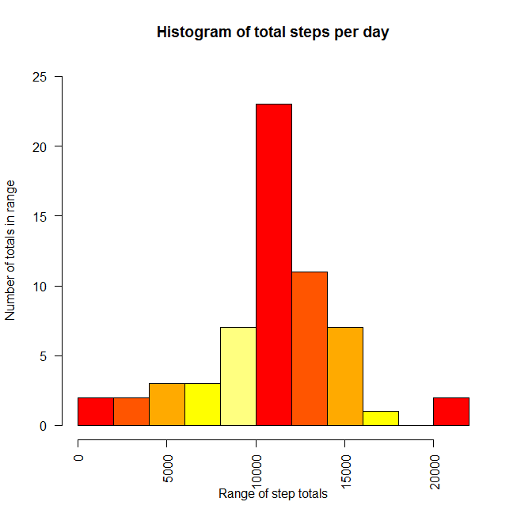
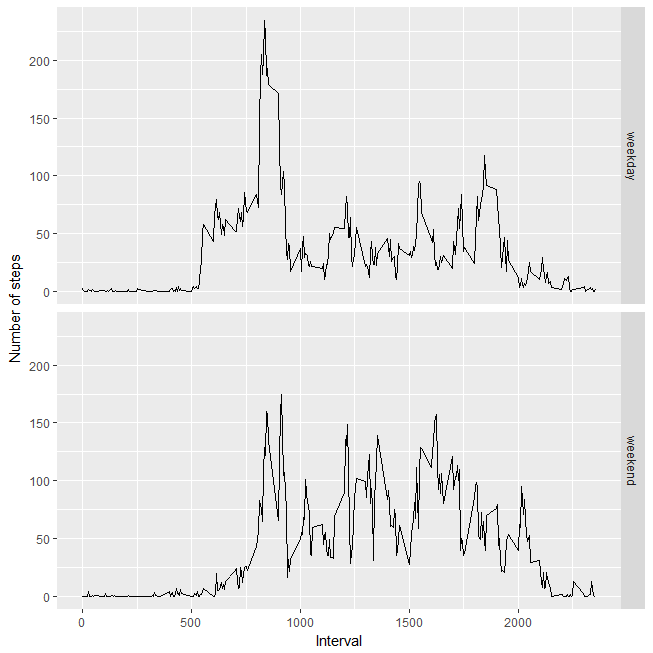

Project Assignment 1 (Peer Assessment)
======================================

Introduction

This is the first assessment using r markdown. We will load the required
data in r and massage the data to answer the required questions
available.

1.  Load data

<!-- -->

    setwd("C:/Users/nurfaridah/Documents/DATA_SCIENCE/5.Reproducible_Research/week2")
    rawdata <- read.csv("activity.csv", stringsAsFactors=FALSE)

1.  Get to know the data

<!-- -->

    head(rawdata)

    ##   steps       date interval
    ## 1    NA 2012-10-01        0
    ## 2    NA 2012-10-01        5
    ## 3    NA 2012-10-01       10
    ## 4    NA 2012-10-01       15
    ## 5    NA 2012-10-01       20
    ## 6    NA 2012-10-01       25

    dim(rawdata)

    ## [1] 17568     3

    str(rawdata)

    ## 'data.frame':    17568 obs. of  3 variables:
    ##  $ steps   : int  NA NA NA NA NA NA NA NA NA NA ...
    ##  $ date    : chr  "2012-10-01" "2012-10-01" "2012-10-01" "2012-10-01" ...
    ##  $ interval: int  0 5 10 15 20 25 30 35 40 45 ...

1.  Questions.

-   What is total number of steps taken per day?
-   Make a histogram of the total number of steps taken each day.
-   Calculate and report the mean and median of the total number of
    steps taken per day.

<!-- -->

    total_steps_per_day <- tapply(rawdata$steps, rawdata$date, sum, na.rm=TRUE)
    total_steps_per_day

    ## 2012-10-01 2012-10-02 2012-10-03 2012-10-04 2012-10-05 2012-10-06 
    ##          0        126      11352      12116      13294      15420 
    ## 2012-10-07 2012-10-08 2012-10-09 2012-10-10 2012-10-11 2012-10-12 
    ##      11015          0      12811       9900      10304      17382 
    ## 2012-10-13 2012-10-14 2012-10-15 2012-10-16 2012-10-17 2012-10-18 
    ##      12426      15098      10139      15084      13452      10056 
    ## 2012-10-19 2012-10-20 2012-10-21 2012-10-22 2012-10-23 2012-10-24 
    ##      11829      10395       8821      13460       8918       8355 
    ## 2012-10-25 2012-10-26 2012-10-27 2012-10-28 2012-10-29 2012-10-30 
    ##       2492       6778      10119      11458       5018       9819 
    ## 2012-10-31 2012-11-01 2012-11-02 2012-11-03 2012-11-04 2012-11-05 
    ##      15414          0      10600      10571          0      10439 
    ## 2012-11-06 2012-11-07 2012-11-08 2012-11-09 2012-11-10 2012-11-11 
    ##       8334      12883       3219          0          0      12608 
    ## 2012-11-12 2012-11-13 2012-11-14 2012-11-15 2012-11-16 2012-11-17 
    ##      10765       7336          0         41       5441      14339 
    ## 2012-11-18 2012-11-19 2012-11-20 2012-11-21 2012-11-22 2012-11-23 
    ##      15110       8841       4472      12787      20427      21194 
    ## 2012-11-24 2012-11-25 2012-11-26 2012-11-27 2012-11-28 2012-11-29 
    ##      14478      11834      11162      13646      10183       7047 
    ## 2012-11-30 
    ##          0

    hist(total_steps_per_day, col = heat.colors(3))

    mean_steps <- mean(rawdata$steps, na.rm=TRUE)
    mean_steps

    ## [1] 37.3826

    median_steps <- median(rawdata$steps, na.rm=TRUE)
    median_steps

    ## [1] 0

    summary(rawdata)

    ##      steps            date              interval     
    ##  Min.   :  0.00   Length:17568       Min.   :   0.0  
    ##  1st Qu.:  0.00   Class :character   1st Qu.: 588.8  
    ##  Median :  0.00   Mode  :character   Median :1177.5  
    ##  Mean   : 37.38                      Mean   :1177.5  
    ##  3rd Qu.: 12.00                      3rd Qu.:1766.2  
    ##  Max.   :806.00                      Max.   :2355.0  
    ##  NA's   :2304

1.  Questions.

-   What is the average daily activity pattern?
-   Which, on average across all the days in the dataset, contains the
    maximum number of steps?

<!-- -->

    stepsdata <- aggregate(steps ~ interval, data=rawdata, mean, na.rm=TRUE)
    plot(stepsdata$interval, stepsdata$steps, type="l", main="Average Steps per Five Minute Interval",
         xlab="Interval no", ylab="Daily steps")

    stepsdata[which.max(stepsdata$steps), ]$interval

    ## [1] 835

1.  Imputing missing values

-   Calculate and report the total number of missing values in the
    dataset (i.e. the total number of rows with NAs)

<!-- -->

    sum(is.na(rawdata))

    ## [1] 2304

-   Devise a strategy for filling in all of the missing values in
    the dataset. The strategy does not need to be sophisticated. For
    example, you could use the mean/median for that day, or the mean for
    that 5-minute interval, etc.
-   Create a new dataset that is equal to the original dataset but with
    the missing data filled in.
-   Here, what I do is, im using the random number generation (set.seed)

<!-- -->

    library(dplyr)

    ## Warning: package 'dplyr' was built under R version 3.3.2

    ## 
    ## Attaching package: 'dplyr'

    ## The following objects are masked from 'package:stats':
    ## 
    ##     filter, lag

    ## The following objects are masked from 'package:base':
    ## 
    ##     intersect, setdiff, setequal, union

    set.seed(1234)
    newdata <- floor(runif(nrow(rawdata), 
                      min = min(rawdata$steps, na.rm = T), 
                      max = max(rawdata$steps, na.rm = T)/10))

    rep  <- which(is.na(rawdata$steps))
    head(rep)

    ## [1] 1 2 3 4 5 6

    rawdata$steps[rep]<- newdata[rep]

    complete_data  <- rawdata %>% 
                      group_by(date) %>% 
                      summarise(daily_step_count = sum(steps))

-   Make a histogram of the total number of steps taken each day.
    Calculate and report the mean and median total number of steps taken
    per day. Do these values differ from the estimates from the first
    part of the assignment? What is the impact of imputing missing data
    on the estimates of the total daily number of steps?

<!-- -->

    hist(complete_data$daily_step_count, 
        breaks = 10,
        main = "Histogram of total steps per day",
        xlab = "Range of step totals",
        ylab = "Number of totals in range",
        border = "black",
        col = heat.colors(5),
        las = 2,
        ylim = c(0, 25))

    dev.copy(png,'complete_data_daily_step_count_1.png') #export png

    ## png 
    ##   3

    dev.off()

    ## png 
    ##   2

    newmean <- mean(complete_data$daily_step_count, na.rm=TRUE)
    newmean

    ## [1] 10858.38

    newmedian <- median(complete_data$daily_step_count, na.rm=TRUE)
    newmedian

    ## [1] 11196

1.  Are there differences in activity patterns between weekdays and
    weekends?

-   Create a new factor variable in the dataset with two levels -
    "weekday" and "weekend" indicating whether a given date is a weekday
    or weekend day. \# indicating whether a given date is a weekday or
    weekend day.

<!-- -->

    rawdatanew <- read.csv("activity.csv", stringsAsFactors=FALSE)

    weekday.or.weekend <- function(date) {
      day <- weekdays(date)
      if (day %in% c("Monday", "Tuesday", "Wednesday", "Thursday", "Friday"))
        return("weekday")
      else if (day %in% c("Saturday", "Sunday"))
        return("weekend")
      else
        stop("invalid date")
    }

    rawdatanew$date <- as.Date(rawdatanew$date)
    rawdatanew$day <- sapply(rawdatanew$date, FUN=weekday.or.weekend)

-   Make a panel plot containing a time series plot (i.e. type = "l") of
    the 5-minute interval (x-axis) and the average number of steps
    taken, averaged across all weekday days or weekend days (y-axis).
    See the README file in the GitHub repository to see an example of
    what this plot should look like using simulated data.

<!-- -->

    library(ggplot2)

    ## Warning: package 'ggplot2' was built under R version 3.3.2

    averages <- aggregate(steps ~ interval + day, data=rawdatanew, mean)
    ggplot(averages, aes(interval, steps)) + geom_line() + facet_grid(day ~ .) +
    xlab("Interval") + ylab("Number of steps") 

    complete_data$daily_step_count

    ##  [1] 11132   126 11352 12116 13294 15420 11015 11567 12811  9900 10304
    ## [12] 17382 12426 15098 10139 15084 13452 10056 11829 10395  8821 13460
    ## [23]  8918  8355  2492  6778 10119 11458  5018  9819 15414 11634 10600
    ## [34] 10571 11237 10439  8334 12883  3219 11527 12193 12608 10765  7336
    ## [45] 11267    41  5441 14339 15110  8841  4472 12787 20427 21194 14478
    ## [56] 11834 11162 13646 10183  7047 11196
